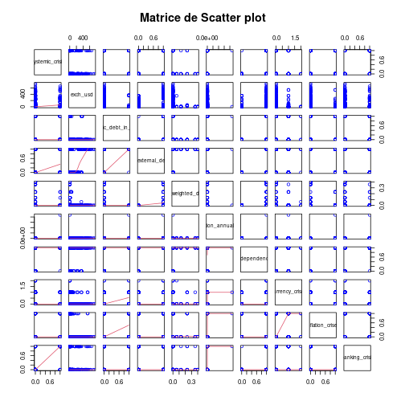

# RAPPORT DE L'ÉTUDE

Données sur la crise économique, bancaire et systémique en Afrique dans 13 pays africains (1860 à 2014) 

**Le contexte** 
Cet ensemble de données est un dérivé de Reinhart et. al's Global Financial Stability dataset, disponible en ligne à l'adresse https://www.hbs.edu/behavioral-finance-and-financial-stability/data/Pages/global.aspx 
 
**Contenu** 
L'ensemble de données se concentre spécifiquement sur les crises bancaires, d'endettement, financières, d'inflation et systémiques qui se sont produites, de 1860 à 2014, dans 13 pays africains, dont: Algérie, Angola, République centrafricaine, Côte d'Ivoire, Égypte, Kenya, Maurice, Maroc, Nigéria, Afrique du Sud, Tunisie, Zambie et Zimbabwe. 

**Question :** 
Quels sont les facteurs les plus associés aux crises systémiques en Afrique?

>
**Variables**
>
**case :** Un nombre qui désigne un pays spécifique
>
**cc3 :** Un code de pays à trois lettres 
>
**contry :** Le nom du pays 
>
**year :** L'année de l'observation
>
**systemic_crisis :** «0» signifie qu'aucune crise systémique n'est survenue dans l'année et «1» signifie qu'une crise systémique s'est produite dans l'année.
>
**exch_usd :** Le taux de change du pays vis-à-vis de l'USD
Dollar américain (USD)
>
**domestic_debt_in_default :** "0" signifie qu'aucune défaillance de la dette intérieure souveraine n'est survenue au cours de l'année et "1" signifie qu'une défaillance de la dette intérieure souveraine s'est produite au cours de l'année 
>
**sovereign_external_debt_default :** "0" signifie qu'aucune défaillance de la dette extérieure souveraine n'est survenue au cours de l'année et "1" signifie qu'une défaillance de la dette extérieure souveraine s'est produite au cours de l'année 
>
**gdp_weighted_default :** La dette totale en défaut vis-à-vis du PIB 
>
**inflation_annual_cpi :** Le taux d'inflation annuel de l'IPC
>
**independence :** "0" signifie "pas d'indépendance" et "1" signifie "indépendance" 
>
**currency_crises :** "0" signifie qu'aucune crise de change n'est survenue au cours de l'année et "1" signifie qu'une crise de change s'est produite au cours de l'année 
>
**inflation_crises :** "0" signifie qu'aucune crise d'inflation n'est survenue au cours de l'année et "1" signifie qu'une crise d'inflation s'est produite au cours de l'année 
>
**banking_crisis :** "no_crisis" signifie qu'aucune crise bancaire n'est survenue au cours de l'année et "crise" signifie qu'une crise bancaire s'est produite au cours de l'année 


## I. Chargement de la data frame African_crises.csv
**On commence par charger notre jeu de données African_crises.csv**


## II. Lecture des données
**Affichage de quelques lignes de la data framme**

```
##   case cc3 country year systemic_crisis exch_usd domestic_debt_in_default sovereign_external_debt_default
## 1    1 DZA Algeria 1870               1 0.052264                        0                               0
## 2    1 DZA Algeria 1871               0 0.052798                        0                               0
## 3    1 DZA Algeria 1872               0 0.052274                        0                               0
## 4    1 DZA Algeria 1873               0 0.051680                        0                               0
## 5    1 DZA Algeria 1874               0 0.051308                        0                               0
## 6    1 DZA Algeria 1875               0 0.051546                        0                               0
##   gdp_weighted_default inflation_annual_cpi independence currency_crises inflation_crises banking_crisis
## 1                    0             3.441456            0               0                0         crisis
## 2                    0            14.149140            0               0                0      no_crisis
## 3                    0            -3.718593            0               0                0      no_crisis
## 4                    0            11.203897            0               0                0      no_crisis
## 5                    0            -3.848561            0               0                0      no_crisis
## 6                    0           -20.924178            0               0                0      no_crisis
```
**Résumé des données**

```
##       case           cc3              country               year      systemic_crisis      exch_usd       
##  Min.   : 1.00   Length:1059        Length:1059        Min.   :1860   Min.   :0.00000   Min.   :  0.0000  
##  1st Qu.:15.00   Class :character   Class :character   1st Qu.:1951   1st Qu.:0.00000   1st Qu.:  0.1954  
##  Median :38.00   Mode  :character   Mode  :character   Median :1973   Median :0.00000   Median :  0.8684  
##  Mean   :35.61                                         Mean   :1968   Mean   :0.07743   Mean   : 43.1408  
##  3rd Qu.:56.00                                         3rd Qu.:1994   3rd Qu.:0.00000   3rd Qu.:  8.4628  
##  Max.   :70.00                                         Max.   :2014   Max.   :1.00000   Max.   :744.3061  
##  domestic_debt_in_default sovereign_external_debt_default gdp_weighted_default inflation_annual_cpi  independence   
##  Min.   :0.00000          Min.   :0.000                   Min.   :0.000000     Min.   :     -29     Min.   :0.0000  
##  1st Qu.:0.00000          1st Qu.:0.000                   1st Qu.:0.000000     1st Qu.:       2     1st Qu.:1.0000  
##  Median :0.00000          Median :0.000                   Median :0.000000     Median :       6     Median :1.0000  
##  Mean   :0.03966          Mean   :0.153                   Mean   :0.006402     Mean   :   20849     Mean   :0.7762  
##  3rd Qu.:0.00000          3rd Qu.:0.000                   3rd Qu.:0.000000     3rd Qu.:      12     3rd Qu.:1.0000  
##  Max.   :1.00000          Max.   :1.000                   Max.   :0.400000     Max.   :21989695     Max.   :1.0000  
##  currency_crises  inflation_crises banking_crisis    
##  Min.   :0.0000   Min.   :0.0000   Length:1059       
##  1st Qu.:0.0000   1st Qu.:0.0000   Class :character  
##  Median :0.0000   Median :0.0000   Mode  :character  
##  Mean   :0.1322   Mean   :0.1294                     
##  3rd Qu.:0.0000   3rd Qu.:0.0000                     
##  Max.   :2.0000   Max.   :1.0000
```
Ces actions nous permettent de détecter des anomalies.


## III. Nettoyage des données
Nous avons transformés la variable crise systémique en une variable quantitative et avons procédés a un recodage de la variable en "0 et 1".


## IV. Visualisation

### 1. Représentation de tous les pays en fonction de la quantité de données


Ce graphique nous montre le nombre d'observation par pays. On remarque l’Égypte est le pays qui a le plus grands nombre d'observation tan-disque la République de Centre Afrique a le plus petit nombre d'observation.


### 2. Représentation de la variable crise systémique


De façon générale on observe une plus grande fréquence pour la modalité "pas de crise systémique" par rapport à la modalité "crise systémique".


### 3. Représentation de la variable crise systémique en fonction de chaque pays


### 4. Représentation de la dette totale en défaut vis-à-vis du PIB au cours des années


On remarque que la quasi-totalité des pays ont commencés a s'endetter à partir des années 1960 (année indépendance massive de plusieurs pays africains)


### 5. Représentation du taux d'inflation annuel de l'IPC au fil des années


Les différents pays n'ont pratiquement pas connus d'inflation annuel de l'IPC.


### Représentation du taux de change des pays vis-à-vis de l'USD au cours des années


### 6. Représentation de l'évolution du taux de change des pays vis-à-vis de l'USD en fonction de chaque pays


## V. Mise en corrélation des différentes variables d'intérêts


## VI. Représentation de la matrice de scatter plot



## VII. La régression Linéaire 

```
## 
## Call:
## lm(formula = systemic_crisis ~ exch_usd + domestic_debt_in_default + 
##     sovereign_external_debt_default + gdp_weighted_default + 
##     inflation_annual_cpi + independence + currency_crises + inflation_crises + 
##     banking_crisis, data = d2)
## 
## Coefficients:
##                     (Intercept)                         exch_usd         domestic_debt_in_default  
##                       2.839e-03                        4.029e-05                       -1.545e-01  
## sovereign_external_debt_default             gdp_weighted_default             inflation_annual_cpi  
##                       6.631e-02                       -3.112e-01                        1.380e-08  
##                    independence                  currency_crises                 inflation_crises  
##                       3.109e-03                       -1.362e-02                       -1.161e-02  
##                  banking_crisis  
##                       8.047e-01
```

```
## 
## Call:
## lm(formula = systemic_crisis ~ exch_usd + domestic_debt_in_default + 
##     sovereign_external_debt_default + gdp_weighted_default + 
##     inflation_annual_cpi + independence + currency_crises + inflation_crises + 
##     banking_crisis, data = d2)
## 
## Residuals:
##      Min       1Q   Median       3Q      Max 
## -0.81140 -0.00620 -0.00596 -0.00284  1.00680 
## 
## Coefficients:
##                                   Estimate Std. Error t value Pr(>|t|)    
## (Intercept)                      2.839e-03  9.118e-03   0.311 0.755612    
## exch_usd                         4.029e-05  4.563e-05   0.883 0.377449    
## domestic_debt_in_default        -1.545e-01  2.663e-02  -5.800 8.75e-09 ***
## sovereign_external_debt_default  6.631e-02  1.759e-02   3.770 0.000172 ***
## gdp_weighted_default            -3.112e-01  1.103e-01  -2.821 0.004883 ** 
## inflation_annual_cpi             1.380e-08  6.293e-09   2.192 0.028588 *  
## independence                     3.109e-03  1.045e-02   0.298 0.766046    
## currency_crises                 -1.362e-02  1.335e-02  -1.020 0.307795    
## inflation_crises                -1.161e-02  1.410e-02  -0.823 0.410508    
## banking_crisis                   8.047e-01  1.591e-02  50.565  < 2e-16 ***
## ---
## Signif. codes:  0 '***' 0.001 '**' 0.01 '*' 0.05 '.' 0.1 ' ' 1
## 
## Residual standard error: 0.1362 on 1049 degrees of freedom
## Multiple R-squared:  0.7426,	Adjusted R-squared:  0.7404 
## F-statistic: 336.3 on 9 and 1049 DF,  p-value: < 2.2e-16
```

```
## Analysis of Variance Table
## 
## Response: systemic_crisis
##                                   Df Sum Sq Mean Sq  F value    Pr(>F)    
## exch_usd                           1  3.108   3.108  167.419 < 2.2e-16 ***
## domestic_debt_in_default           1  1.109   1.109   59.760 2.501e-14 ***
## sovereign_external_debt_default    1  1.457   1.457   78.462 < 2.2e-16 ***
## gdp_weighted_default               1  0.248   0.248   13.335 0.0002734 ***
## inflation_annual_cpi               1  0.611   0.611   32.923 1.254e-08 ***
## independence                       1  0.603   0.603   32.457 1.582e-08 ***
## currency_crises                    1  0.344   0.344   18.522 1.837e-05 ***
## inflation_crises                   1  1.236   1.236   66.565 9.614e-16 ***
## banking_crisis                     1 47.463  47.463 2556.820 < 2.2e-16 ***
## Residuals                       1049 19.473   0.019                       
## ---
## Signif. codes:  0 '***' 0.001 '**' 0.01 '*' 0.05 '.' 0.1 ' ' 1
```


## VIII. Séléction des variables contribuant au plus à la crise systémique

```
## Start:  AIC=-2792.65
## systemic_crisis ~ 1
## 
##                                   Df Sum of Sq    RSS     AIC
## + banking_crisis                   1    55.135 20.516 -4172.6
## + sovereign_external_debt_default  1     4.722 70.928 -2858.9
## + exch_usd                         1     3.108 72.543 -2835.1
## + inflation_crises                 1     2.253 73.398 -2822.7
## + independence                     1     1.637 74.014 -2813.8
## + domestic_debt_in_default         1     1.129 74.522 -2806.6
## + currency_crises                  1     0.962 74.689 -2804.2
## + inflation_annual_cpi             1     0.857 74.793 -2802.7
## <none>                                         75.651 -2792.7
## + gdp_weighted_default             1     0.002 75.649 -2790.7
## 
## Step:  AIC=-4172.57
## systemic_crisis ~ banking_crisis
## 
##                                   Df Sum of Sq    RSS     AIC
## + domestic_debt_in_default         1     0.397 20.119 -4191.3
## + exch_usd                         1     0.267 20.248 -4184.5
## + currency_crises                  1     0.069 20.447 -4174.1
## + inflation_crises                 1     0.066 20.450 -4174.0
## + sovereign_external_debt_default  1     0.049 20.467 -4173.1
## <none>                                         20.516 -4172.6
## + inflation_annual_cpi             1     0.037 20.479 -4172.5
## + gdp_weighted_default             1     0.023 20.493 -4171.8
## + independence                     1     0.009 20.507 -4171.0
## - banking_crisis                   1    55.135 75.651 -2792.7
## 
## Step:  AIC=-4191.28
## systemic_crisis ~ banking_crisis + domestic_debt_in_default
## 
##                                   Df Sum of Sq    RSS     AIC
## + sovereign_external_debt_default  1     0.298 19.820 -4205.1
## + exch_usd                         1     0.246 19.873 -4202.3
## + inflation_annual_cpi             1     0.078 20.040 -4193.4
## <none>                                         20.119 -4191.3
## + gdp_weighted_default             1     0.030 20.088 -4190.9
## + inflation_crises                 1     0.021 20.097 -4190.4
## + independence                     1     0.021 20.098 -4190.4
## + currency_crises                  1     0.020 20.099 -4190.3
## - domestic_debt_in_default         1     0.397 20.516 -4172.6
## - banking_crisis                   1    54.403 74.522 -2806.6
## 
## Step:  AIC=-4205.09
## systemic_crisis ~ banking_crisis + domestic_debt_in_default + 
##     sovereign_external_debt_default
## 
##                                   Df Sum of Sq    RSS     AIC
## + gdp_weighted_default             1     0.189 19.631 -4213.2
## + inflation_annual_cpi             1     0.081 19.739 -4207.4
## + exch_usd                         1     0.077 19.744 -4207.2
## <none>                                         19.820 -4205.1
## + currency_crises                  1     0.036 19.785 -4205.0
## + inflation_crises                 1     0.033 19.788 -4204.8
## + independence                     1     0.002 19.818 -4203.2
## - sovereign_external_debt_default  1     0.298 20.119 -4191.3
## - domestic_debt_in_default         1     0.647 20.467 -4173.1
## - banking_crisis                   1    51.104 70.925 -2857.0
## 
## Step:  AIC=-4213.24
## systemic_crisis ~ banking_crisis + domestic_debt_in_default + 
##     sovereign_external_debt_default + gdp_weighted_default
## 
##                                   Df Sum of Sq    RSS     AIC
## + inflation_annual_cpi             1     0.082 19.550 -4215.7
## + currency_crises                  1     0.039 19.593 -4213.3
## <none>                                         19.631 -4213.2
## + inflation_crises                 1     0.034 19.597 -4213.1
## + exch_usd                         1     0.025 19.606 -4212.6
## + independence                     1     0.002 19.629 -4211.4
## - gdp_weighted_default             1     0.189 19.820 -4205.1
## - sovereign_external_debt_default  1     0.457 20.088 -4190.9
## - domestic_debt_in_default         1     0.776 20.407 -4174.2
## - banking_crisis                   1    50.717 70.349 -2863.6
## 
## Step:  AIC=-4215.66
## systemic_crisis ~ banking_crisis + domestic_debt_in_default + 
##     sovereign_external_debt_default + gdp_weighted_default + 
##     inflation_annual_cpi
## 
##                                   Df Sum of Sq    RSS     AIC
## + currency_crises                  1     0.043 19.507 -4216.0
## + inflation_crises                 1     0.038 19.512 -4215.7
## <none>                                         19.550 -4215.7
## + exch_usd                         1     0.027 19.522 -4215.1
## + independence                     1     0.003 19.547 -4213.8
## - inflation_annual_cpi             1     0.082 19.631 -4213.2
## - gdp_weighted_default             1     0.190 19.739 -4207.4
## - sovereign_external_debt_default  1     0.460 20.010 -4193.0
## - domestic_debt_in_default         1     0.827 20.376 -4173.8
## - banking_crisis                   1    50.209 69.758 -2870.5
## 
## Step:  AIC=-4215.99
## systemic_crisis ~ banking_crisis + domestic_debt_in_default + 
##     sovereign_external_debt_default + gdp_weighted_default + 
##     inflation_annual_cpi + currency_crises
## 
##                                   Df Sum of Sq    RSS     AIC
## <none>                                         19.507 -4216.0
## - currency_crises                  1     0.043 19.550 -4215.7
## + exch_usd                         1     0.018 19.488 -4215.0
## + inflation_crises                 1     0.017 19.489 -4214.9
## + independence                     1     0.003 19.503 -4214.2
## - inflation_annual_cpi             1     0.086 19.593 -4213.3
## - gdp_weighted_default             1     0.193 19.699 -4207.6
## - sovereign_external_debt_default  1     0.482 19.989 -4192.1
## - domestic_debt_in_default         1     0.765 20.271 -4177.3
## - banking_crisis                   1    49.995 69.502 -2872.4
```

```
## 
## Call:
## lm(formula = systemic_crisis ~ banking_crisis + domestic_debt_in_default + 
##     sovereign_external_debt_default + gdp_weighted_default + 
##     inflation_annual_cpi + currency_crises, data = d2)
## 
## Coefficients:
##                     (Intercept)                   banking_crisis         domestic_debt_in_default  
##                       5.426e-03                        8.047e-01                       -1.633e-01  
## sovereign_external_debt_default             gdp_weighted_default             inflation_annual_cpi  
##                       7.486e-02                       -3.395e-01                        1.355e-08  
##                 currency_crises  
##                      -1.893e-02
```


## IX. Conclusion

Au terme de cette étude on peut dire que les facteurs (variables) qui sont liés ou qui contribuent le plus à la crise systémique ("systemic_crisis") en Afrique notamment dans le cas des 13 pays sont : 

- Crise bancaire ("banking_crisis")
- Défaillance de la dette intérieure souveraine ("domestic_debt_in_default")
- Défaillance de la dette extérieure souveraine ("sovereign_external_debt_default")
- Dette totale en défaut vis-à-vis du PIB  ("gdp_weighted_default")
- Taux d'inflation annuel de l'IPC ("inflation_annual_cpi")
- Crise de change ("currency_crises")


